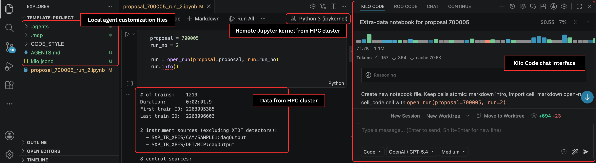

# From Overload to Insights: How AI Agents Can Support Scientists in Analyzing Complex Data [Replication Package]

## Artifact Summary

This repository contains the replication package for the paper "From Overload to Insights: How AI Agents Can Support Scientists in Analyzing Complex Data," accepted at the *[42nd IEEE International Conference on Software Maintenance and Evolution (ICSME'26)](https://conf.researchr.org/details/icsme-2026/icsme-2026-industry-track/1/From-Overload-to-Insights-How-AI-Agents-Can-Support-Scientists-in-Analyzing-Complex-)*.  

The purpose of the package is to facilitate the verification and reproduction of the study results.
It provides artifacts for all seven research activities.
Fig. 1 displays the second prototype created and evaluated during the study.


*Fig. 1. Data analysis in Visual Studio Code with Kilo Code agent, agent customization files, and remote Jupyter kernel from HPC cluster of European XFEL*

## Paper Abstract

Scientists at the European XFEL conduct experiments that generate very large and complex datasets.
The subsequent data analysis is challenging as scientists must combine their domain expertise with facility- and software-specific knowledge scattered across documentation, tools, and support channels.
To address this problem, we designed and evaluated an agentic artificial intelligence (AI) system tailored to the scientists’ needs and integrated with the European XFEL high-performance computing environment.
Using a design science research approach, we conducted a rapid literature review, a systematic evaluation of 16 AI tools, multiple interviews, a focus group, and a user study with experts at European XFEL to develop and evaluate two prototypes.
Our study identifies key knowledge challenges in scientific data analysis, derives requirements for an AI agent that supports knowledge retrieval and code generation, and proposes design recommendations for a specialized system that is adaptable to the evolving AI tool landscape.
Our findings provide guidance for developing maintainable AI support in highly specialized scientific environments.

## References

This replication package is available on [Zenodo](https://doi.org/10.5281/zenodo.21187439).

The published paper will be available on [IEEE Xplore](/) and the preprint on [arXiv](/). // TODO add Xplore and arXiv links

## Authors

- [Tim Fuchs](mailto:tim.fuchs-2@uni-hamburg.de) (University of Hamburg)
- [Luca Gelisio](mailto:luca.gelisio@xfel.eu) (European XFEL)
- [Steffen Hauf](mailto:steffen.hauf@xfel.eu) (European XFEL)
- [Walid Maalej](mailto:walid.maalej@hpi.de) (Hasso-Plattner-Institute and University of Hamburg)

## Artifact Citation

BibTeX:

```bibtex
@dataset{fuchs-zenodo-2026,
  author    = {Fuchs, Tim and Gelisio, Luca and Hauf, Steffen and Maalej, Walid},
  title     = {From Overload to Insights: How AI Agents Can Support Scientists in Analyzing Complex Data [Replication Package]},
  month     = sep,
  year      = 2026,
  publisher = {Zenodo},
  doi       = {10.5281/zenodo.21187439},
}
```

## Description of Artifact Components

The folders contain the artifacts of the research activities (please follow the links for detailed descriptions):

- [Initial interviews with managers](./01-initial-interviews/README.md)
- [Focus group with Data Analysis group](./02-focus-group/README.md)
- [Interviews with facility users and members](./03-interviews-users-members/README.md)
- [Design, demonstration, and evaluation of first prototype](./04-prototype-first-version/README.md)
- [Rapid, multivocal literature review](./05-rapid-literature-review/README.md)
- [Evaluation of solutions for agentic AI system components](./06-tool-evaluation/README.md)
- [Design, demonstration, and evaluation of second prototype](./07-prototype-second-version/README.md)

Miscellaneous:

- [Scientific log](scientific-log.md): chronological report of events related to this study
- [Assets](./assets/prototype.png): files embedded in this and other Markdown files of this replication package
- [Licenses](./LICENSES/CC-BY-4.0.md): license files of this replication package
- [Gitignore](.gitignore): file that lists anything that should be ignored by versioning system

## System Requirements

- [VS Code](https://code.visualstudio.com) (to open any files and to start any relevant software via built-in terminal)
- VS Code extensions:
  - [Jupyter](https://marketplace.visualstudio.com/items?itemName=ms-toolsai.jupyter) (to set up second prototype)
  - [Office Viewer](https://marketplace.visualstudio.com/items?itemName=cweijan.vscode-office) (to open `.xlsx` overview file of literature review)
  - [Edit CSV](https://marketplace.visualstudio.com/items?itemName=janisdd.vscode-edit-csv) (to display content of `.csv` literature review files in tables)
- [Python](https://www.python.org/downloads/) (To run Python scripts of literature review. We recommend version 3.14.5.)
- [Docker](https://www.docker.com) (to set up second prototype)
- Any web browser (to view `.html` files)

## Installation

- You must conduct installation procedures to repeat the steps of the [literature review](./05-rapid-literature-review/README.md) and to set up the [second prototype](./07-prototype-second-version/README.md).
- Follow the documentation in both folders.

## Usage

- Follow the documentation in the folders to review the detailed artifacts of each research activity.
- Read the scientific log to review the events of this study in chronological order.

## Revisions

| Version | Note                              |
| ------- | --------------------------------- |
| 0.2.0   | Add Zenodo DOI and paper abstract |
| 0.1.0   | Initial upload                    |

## Licenses

All software is licensed under the [Apache 2.0](/LICENSES/Apache-2.0) license.
All non-software is licensed under the [Creative Commons Attribution 4.0 International](/LICENSES/CC-BY-4.0.md) license.
